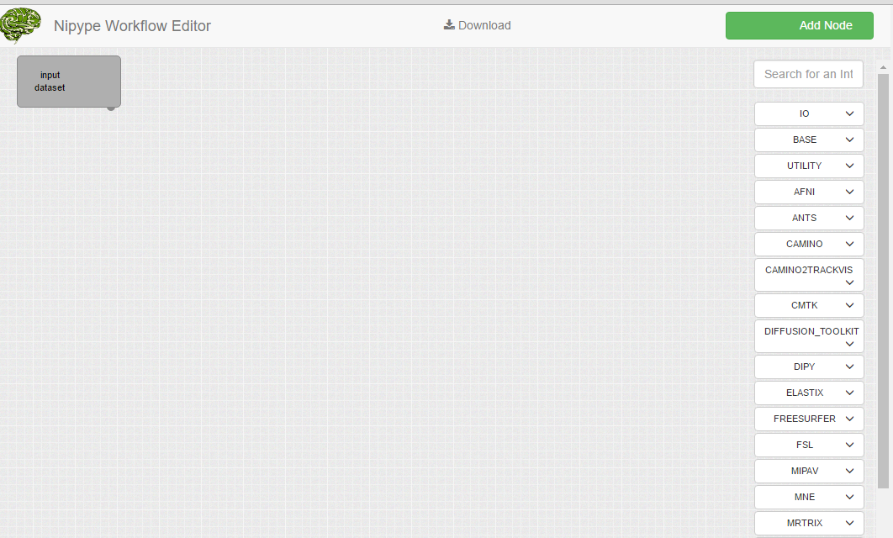

Nipype Workflow Editor
======================

 

 

| Buildstatus Master Branch  | <https://travis-ci.org/hlaubisch/Nipype.workflow-editor.svg?branch=master>  |
|----------------------------|-----------------------------------------------------------------------------|
| Buildstatus Develop Branch | <https://travis-ci.org/hlaubisch/Nipype.workflow-editor.svg?branch=develop> |

 

TravisCI Project
[\*\*Here](https://travis-ci.org/hlaubisch/Nipype.workflow-editor)\*\*

 

Create and edit Nipype workflows in the browser.

 

 

Example
-------

  <https://waffle.io/hlaubisch/Nipype.workflow-editor>

Current interface with supported nodes on the right selection panel.

 

 
